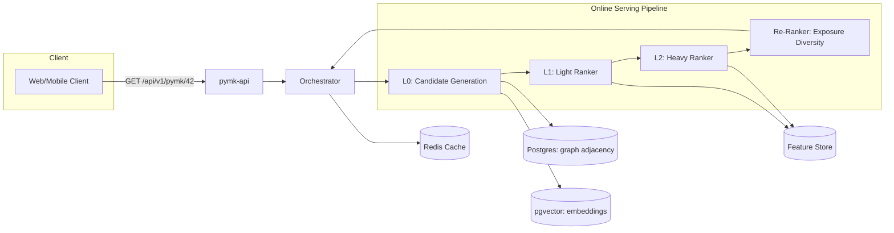

# People You May Know (PYMK)

A portfolio-scale reimplementation of LinkedIn-style **"People You May Know"**
recommendations, built on the Java/Spring ecosystem, following the
multi-stage funnel architecture described in LinkedIn Engineering's public
PYMK writeup: **candidate generation (L0) → light ranking (L1) → heavy
ranking (L2) → re-ranking (exposure diversity)**.

> 🚧 **Status: Day 9 of 30 complete** — the M1 foundation is complete and all
> three M2 candidate sources are implemented and tested.
> See [`docs/PYMK_ROADMAP.md`](docs/PYMK_ROADMAP.md) for the day-by-day
> build log and [`docs/PYMK_DESIGN.md`](docs/PYMK_DESIGN.md) for the full
> system design.

---

## Why this project

Most CRUD portfolio projects stop at "REST API + database." This one
demonstrates both sides of a modern recommendation system:

- **Traditional backend engineering:** JPA, REST, Redis caching, Spring
  Batch ETL jobs, multi-module architecture designed to split into
  microservices without a rewrite.
- **Applied ML engineering:** feature engineering, offline model training
  (logistic regression → GBDT → small NN), ONNX/PMML serving from Java,
  offline evaluation (Recall@k, AUC, Precision@k, calibration), and temporal
  replay against a naive baseline. These are offline results, not an A/B test.

## Target architecture

The diagram is the end-state funnel. At the current Day 9 checkpoint, the
domain, data generator, embeddings, initial API, and all three L0 sources are
implemented. Candidate union, L1–L2, the orchestrator, Redis caching, and
re-ranking are scheduled later in the roadmap.



Full architecture, data model, API design, and offline evaluation strategy:
[`docs/PYMK_DESIGN.md`](docs/PYMK_DESIGN.md).

## Tech stack

| Layer | Choice |
|---|---|
| Language / Framework | Java 21, Spring Boot 3.5.x |
| Persistence | Spring Data JPA + PostgreSQL |
| Vector similarity | pgvector (embedding-based retrieval) |
| Caching | Spring Data Redis |
| Batch / ETL | Spring Batch |
| Graph traversal | Postgres recursive CTE |
| ML training | Python (scikit-learn/XGBoost/PyTorch) → ONNX/PMML |
| ML serving | ONNX Runtime Java / JPMML-Evaluator |
| Build | Maven multi-module |
| Testing | JUnit 5, Testcontainers, Mockito |
| Local infra | Docker Compose (Postgres + pgvector, Redis) |

## Repository layout

```
pymk/
├── pymk-common/            # shared DTOs, enums, utils
├── pymk-domain/            # JPA entities, repositories
├── pymk-feature-store/     # feature computation + read/write API
├── pymk-candidate-gen/     # L0: graph, EBR, heuristic candidate sources
├── pymk-light-ranker/      # L1: logistic regression / GBDT scoring
├── pymk-heavy-ranker/      # L2: DNN model serving via ONNX Runtime
├── pymk-reranker/          # exposure diversity, Bayesian-tuned blending
├── pymk-orchestrator/      # wires stages together
├── pymk-api/               # public REST controllers (the runnable app)
├── pymk-batch/             # Spring Batch jobs
├── pymk-datagen/           # dev-tooling CLI: synthetic data generator (Day 4)
├── pymk-ml-training/       # Python project (offline), exports model artifacts
├── infra/                  # docker-compose.yml, init SQL
└── docs/                   # design doc + roadmap
```

`pymk-domain`, `pymk-api`, `pymk-datagen`, and `pymk-candidate-gen` have real
content as of Day 9. The remaining implementation modules are intentionally
skeletal; see the roadmap for what fills in each module and when.

## Data model & how to seed the DB

Flyway migrations are the database schema source of truth; Hibernate validates
the entity mappings against them instead of creating or changing tables.

| Table | Purpose | Important invariant |
|---|---|---|
| `members` | Member profile and heuristic attributes | IDs come from the generator/upstream identity system; they are not database-generated |
| `connections` | First-degree graph adjacency | One undirected connection is stored as two directed rows; self-edges and duplicate directions are rejected |
| `member_events` | Timestamped profile, search, and invite activity | Actor and target must exist; generated invite lifecycles are temporally ordered |
| `member_embeddings` | One 128-dimensional pgvector embedding per member | Uses an HNSW cosine index; current vectors are random normalized placeholders |

`ConnectionService` owns the two-row connection invariant and writes both
directions in one transaction. Application code should not create a single
`connections` row directly.

To create a local database and seed it from a clean checkout:

```bash
# Start Postgres; Redis is not required by the generator yet.
docker compose -f infra/docker-compose.yml up -d postgres

# Build the generator and the modules it depends on.
mvn -B -pl pymk-datagen -am package -DskipTests

# Fast local dataset (20,000 members).
java -jar pymk-datagen/target/pymk-datagen.jar --pymk.datagen.members=20000

# Omit the override for the default 100,000-member dataset.
# java -jar pymk-datagen/target/pymk-datagen.jar
```

The seed defaults to `42`, so profiles and graph topology are reproducible for
the same member count. Timestamps are relative to the run time. The generator
prints row counts, degree percentiles, popular organizations, and event counts
when it finishes. You can independently inspect the loaded tables with:

```bash
docker exec pymk-postgres psql -U pymk -d pymk -c "SELECT 'members' AS table_name, count(*) FROM members UNION ALL SELECT 'connections', count(*) FROM connections UNION ALL SELECT 'member_events', count(*) FROM member_events UNION ALL SELECT 'member_embeddings', count(*) FROM member_embeddings;"
```

> **Reset behavior:** seeding truncates all four generated-data tables by
> default. This is controlled by `--pymk.datagen.truncate-existing=false`, but
> disabling truncation is not an append mode: generated IDs restart at `1` and
> will conflict with an existing generated dataset. PostgreSQL data persists in
> the `pymk_postgres_data` Docker volume; `docker compose -f
> infra/docker-compose.yml down -v` deliberately removes it.

All generator options and their defaults are documented in
[`pymk-datagen/README.md`](pymk-datagen/README.md).

## Quickstart

**Prerequisites:** JDK 21, Maven 3.9+, Docker.

```bash
# 1. Clone
git clone https://github.com/AhdyAhmed/People-You-May-Know-PYMK.git
cd People-You-May-Know-PYMK

# 2. Start Postgres (with pgvector) + Redis
docker compose -f infra/docker-compose.yml up -d

# 3. Build and install all modules (Docker is used by integration tests)
mvn -B install

# 4. Seed a synthetic dataset (~100K members by default; see pymk-datagen/README.md)
mvn -pl pymk-datagen spring-boot:run

# 5. Run the API
mvn -pl pymk-api spring-boot:run
```

Then:
```bash
curl http://localhost:8080/
# {"service":"pymk-api","status":"up","milestone":"M2 - Day 9: all candidate sources complete"}

curl http://localhost:8080/api/v1/members/42      # a seeded member (Day 6, Part 1)
curl -X POST http://localhost:8080/api/v1/connections \
  -H 'Content-Type: application/json' \
  -d '{"memberId": 42, "connectedMemberId": 981}'   # Day 6, Part 2
# Browse to http://localhost:8080/swagger-ui.html for interactive API docs
```

## API (Day 6)

`GET /api/v1/members/{id}` accepts a positive member ID and returns a profile
and its first-degree connection count:

```json
{
  "id": 42,
  "fullName": "Ada Lovelace",
  "headline": "Senior Software Engineer",
  "company": "Acme Corp",
  "school": "MIT",
  "geoRegion": "Cairo",
  "connectionCount": 137,
  "createdAt": "2026-01-15T10:00:00Z"
}
```

`POST /api/v1/connections` stores both directions of the undirected graph edge;
event ingestion is a separate future endpoint. It returns
`201` with `created: true` for a new connection and `200` with `created: false` when
the pair is already connected. Validation and domain failures use RFC 9457
`application/problem+json` responses. The live OpenAPI document is available at
`/v3/api-docs`, with Swagger UI at `/swagger-ui.html`.

## Candidate generation (Days 8–9)

`pymk-candidate-gen` now defines the internal L0 `CandidateSource` contract.
Each `CandidateHit` includes a candidate ID, stable source type, source-local
score, and immutable explanation metadata rather than returning a bare ID.

`HeuristicCandidateSource` retrieves exact
company, school, and geographic-region matches. It sorts by the number of
matching available attributes and then member ID, making limits deterministic.

`GraphWalkCandidateSource` uses a cycle-safe recursive PostgreSQL CTE to find
shortest two/three-hop candidates and count equally short paths.
`EmbeddingRetrievalCandidateSource` uses pgvector cosine distance and exposes
cosine similarity as its source score. Both database queries remove direct
connections before applying their limit, preventing under-filled results.

All sources apply the shared eligibility policy, which removes the requesting
member, current connections, duplicates, and IDs that no longer exist. These
are internal module APIs; Day 10 adds the bounded parallel union and the public
PYMK endpoint arrives on Day 11.

## Tests

```bash
mvn -B verify
```

Repository and integration tests run against a real Postgres (with pgvector)
started by [Testcontainers](https://testcontainers.com/), so **Docker must be
running**, but you do *not* need `docker compose up` for the test suite. Tests
also run `spring.jpa.hibernate.ddl-auto=validate`, so a mismatch between the
JPA entities and the Flyway migrations fails the build.

To stop the local infra: `docker compose -f infra/docker-compose.yml down`
(add `-v` to also wipe the Postgres/Redis volumes).

## Build log

This project is being built in public, one focused session at a time. Each
day's scope and status lives in [`docs/PYMK_ROADMAP.md`](docs/PYMK_ROADMAP.md).

- [x] **Day 1 — Repo & environment setup**: multi-module Maven skeleton (11
      modules), Docker Compose (Postgres + pgvector, Redis), CI build.
- [x] **Day 2 — Core JPA entities**: `Member`, `Connection`, `MemberEvent` (+
      `EventType`) in `pymk-domain`, with a Flyway migration for the schema
      (indexes on `connections`, `member_events`, and the heuristic-source
      lookup columns on `members`).
- [x] **Day 3 — Repositories & basic queries**: Spring Data repositories for
      the three entities, a `ConnectionService` that owns the "one connection =
      two rows" invariant, and Testcontainers tests proving symmetric inserts,
      DB-level constraints, and index-backed adjacency lookups on a 5,000-member
      / ~50K-edge graph.
- [x] **Day 4 — Synthetic data generator**: `pymk-datagen` — Datafaker
      members with a Zipf-weighted company/school/geo pool, a
      Barabási–Albert preferential-attachment connection graph, and
      timeline-consistent invite/profile-view/search events, bulk-loaded via
      chunked JDBC batches with a post-load summary report. Defaults to
      100,000 members.
- [x] **Day 5 — pgvector + embeddings table**: `member_embeddings`
      (Hibernate's native `hibernate-vector` module maps `float[]` to
      pgvector's `vector(128)`), an HNSW cosine-distance index, ANN search
      via `EmbeddingSearchRepository`, placeholder random vectors from
      `pymk-datagen`, and a test proving the ANN query returns
      semantically-sensible neighbors on constructed clusters.
- [x] **Day 6 — `pymk-api` skeleton** *(built in 3 parts)*
  - [x] Part 1 — springdoc OpenAPI + Swagger UI, `GET /api/v1/members/{id}`,
        RFC 9457 `ProblemDetail` error handling, MockMvc + Testcontainers tests.
  - [x] Part 2 — `POST /api/v1/connections`: Bean Validation, idempotent
        (201 created / 200 already connected), 400 self-connect, 404 unknown
        member, 409 on the unique-constraint race.
  - [x] Part 3 — polish: status endpoint, README API section, end-to-end test.
- [x] **Day 7 — Buffer / catch-up + write-up**: audited the completed M1
      foundation, synchronized the live milestone and planning documents, and
      added the data-model and database-seeding runbook.
- [x] **Day 8 — Candidate source contract + heuristic retrieval**:
      provenance-preserving `CandidateHit`, deterministic company/school/geo
      retrieval, shared eligibility filtering, and database-backed tests.
- [x] **Day 9 — Graph-walk + embedding retrieval**: cycle-safe two/three-hop
      recursive traversal, pgvector cosine retrieval, source scoring, pre-limit
      connection exclusion, and deterministic integration fixtures.
- [ ] ... see the roadmap for the full 30-day plan through M8.

## License

[MIT](LICENSE)

## Attribution

Architecture pattern (multi-stage funnel: L0 candidate generation → L1 light
ranking → L2 heavy ranking → re-ranking) adapted from LinkedIn Engineering's
public writeup on the "People You May Know" recommendation system. This is an
original implementation at portfolio scale, not a reproduction of LinkedIn's
internal system or text.
