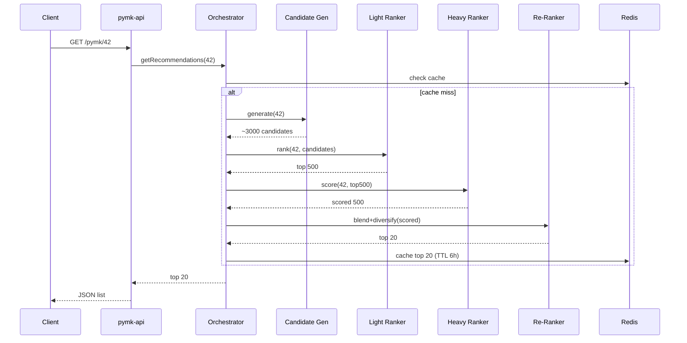

# People You May Know (PYMK) — Backend System Design

A portfolio-scale reimplementation of LinkedIn-style "People You May Know" recommendations, built on the Java ecosystem (Spring Boot, Spring Data JPA), following the multi-stage funnel architecture described in LinkedIn's PYMK engineering blog.

---

## 1. Goals & Scope

**Functional goals**
- Given a member, recommend a ranked list of other members they are likely to connect with.
- Support explicit signals (mutual connections, shared company/school, location) and implicit signals (profile views, search appearances).
- Provide a fairness/diversity pass so results aren't dominated by a single cluster (e.g. all coworkers).
- Serve recommendations with low latency (<150ms p99 target for demo scale).

**Non-functional / portfolio goals**
- Demonstrate a realistic **multi-stage ranking pipeline** (candidate generation → light ranking → heavy ranking → re-ranking), scaled down from "billions of members" to a dataset of ~100K–1M synthetic members, so it runs on a laptop / a single cheap cloud VM but the architecture generalizes.
- Clean separation of concerns so each stage could later be extracted into its own microservice.
- Show both the "traditional Spring backend" skills (JPA, REST, caching, batch jobs) and applied ML engineering (feature engineering, model training/serving, offline evaluation).

**Out of scope (documented, not built)**
- True graph-database-scale traversal (we simulate with a graph adjacency table in Postgres + optional Neo4j module).
- Real-time streaming infra (Kafka is included as an optional module, not mandatory for v1).

---

## 2. High-Level Architecture

```mermaid
flowchart LR
    subgraph Client
        UI[Web/Mobile Client]
    end

    UI -->|GET /pymk/{memberId}| GW[API Gateway / pymk-api]

    GW --> ORCH[Recommendation Orchestrator]

    subgraph Offline["Offline / Batch (Spring Batch + scheduled jobs)"]
        ETL[Feature ETL Jobs]
        TRAIN[Model Training - Python/PySpark or Java ML]
        GRAPH[Graph Index Builder]
    end

    subgraph Online["Online Serving Pipeline"]
        L0[L0: Candidate Generation]
        L1[L1: Light Ranker]
        L2[L2: Heavy Ranker]
        RR[Re-Ranker: Fairness/Diversity]
    end

    ORCH --> L0 --> L1 --> L2 --> RR --> ORCH
    ORCH --> CACHE[(Redis Cache)]
    L0 --> GRAPHDB[(Graph Adjacency Store)]
    L0 --> VEC[(Vector Store - embeddings)]
    L1 --> FEATSTORE[(Feature Store)]
    L2 --> FEATSTORE
    L2 --> MODELSTORE[(Model Registry)]
    ETL --> FEATSTORE
    ETL --> DB[(PostgreSQL - core data)]
    TRAIN --> MODELSTORE
    GRAPH --> GRAPHDB
    ORCH --> DB
```

Each ranking stage is implemented as a **Spring `@Service` with a well-defined interface**, so it can run in-process for v1 and be extracted to its own Spring Boot microservice + REST/gRPC call later without changing the orchestrator's contract.

---

## 3. Tech Stack

| Layer | Choice | Notes |
|---|---|---|
| Language / Framework | Java 21, Spring Boot 3.x | LTS Java, virtual threads for I/O-bound fan-out calls |
| Persistence | Spring Data JPA + PostgreSQL | Core member/connection/event data |
| Caching | Spring Data Redis | Cache L0 candidate sets and final PYMK lists (TTL) |
| Batch / ETL | Spring Batch | Nightly feature computation, model refresh jobs |
| Async / messaging (optional) | Spring Kafka | Event capture (profile views, invites) for feature freshness |
| Graph traversal | Postgres recursive CTE (v1) → Neo4j (v2, optional module) | n-hop neighbor candidate generation |
| Vector similarity | pgvector extension on Postgres | Embedding-based retrieval (EBR) candidate source |
| ML training | Python (scikit-learn/XGBoost) exported to **ONNX** or **PMML**, served from Java via ONNX Runtime / JPMML-Evaluator | Keeps training in the best ecosystem for it, keeps serving in Java |
| ML alternative (pure Java) | Tribuo (Oracle's Java ML library) or Smile | For a "100% Java" version if avoiding Python entirely is a hard requirement |
| API | Spring Web (REST), OpenAPI/Swagger | `pymk-api` module |
| Testing | JUnit5, Testcontainers (Postgres/Redis), Mockito | |
| Build | Maven multi-module or Gradle multi-module | |
| Deployment | Docker Compose (local), optional Kubernetes manifests | |
| Observability | Micrometer + Prometheus + Grafana | Latency/throughput per stage |

---

## 4. Repository / Module Layout

```
pymk/
├── pymk-common/            # shared DTOs, enums, utils
├── pymk-domain/             # JPA entities, repositories
├── pymk-feature-store/      # feature computation + read/write API
├── pymk-candidate-gen/      # L0: graph, EBR, heuristic candidate sources
├── pymk-light-ranker/       # L1: logistic regression / GBDT scoring
├── pymk-heavy-ranker/       # L2: DNN model serving via ONNX Runtime
├── pymk-reranker/           # fairness, diversity, Bayesian-optimized blending
├── pymk-orchestrator/       # wires stages together, exposes internal service API
├── pymk-api/                # public REST controllers, request/response DTOs
├── pymk-batch/               # Spring Batch jobs: ETL, model refresh, graph index build
├── pymk-ml-training/         # Python project (offline), exports model artifacts
├── infra/                    # docker-compose.yml, k8s manifests, init SQL
└── docs/
    └── PYMK_DESIGN.md (this file)
```

---

## 5. Data Model (Spring Data JPA)

### 5.1 Core entities

```java
@Entity
@Table(name = "members")
public class Member {
    @Id
    private Long id;
    private String fullName;
    private String headline;
    private String company;
    private String school;
    private String geoRegion;
    private Instant createdAt;
    // profile completeness, industry, etc.
}

@Entity
@Table(name = "connections", indexes = {
    @Index(name = "idx_conn_member", columnList = "memberId"),
    @Index(name = "idx_conn_connected", columnList = "connectedMemberId")
})
public class Connection {
    @Id @GeneratedValue
    private Long id;
    private Long memberId;
    private Long connectedMemberId;
    private Instant connectedAt;
    // undirected edge, stored as two rows (memberId<->connectedMemberId) for O(1) adjacency lookups
}

@Entity
@Table(name = "member_events")
public class MemberEvent {
    @Id @GeneratedValue
    private Long id;
    private Long actorMemberId;
    private Long targetMemberId;
    @Enumerated(EnumType.STRING)
    private EventType type; // PROFILE_VIEW, SEARCH_APPEARANCE, INVITE_SENT, INVITE_ACCEPTED, INVITE_IGNORED
    private Instant occurredAt;
}

@Entity
@Table(name = "member_embeddings")
public class MemberEmbedding {
    @Id
    private Long memberId;
    @Column(columnDefinition = "vector(128)") // pgvector
    private float[] embedding;
    private Instant updatedAt;
}

@Entity
@Table(name = "pymk_features")
public class PymkPairFeature {
    @EmbeddedId
    private PairId id; // (memberId, candidateId)
    private int mutualConnectionCount;
    private boolean sameCompany;
    private boolean sameSchool;
    private boolean sameGeo;
    private double embeddingCosineSim;
    private int profileViewCountLast30d;
    private Instant computedAt;
}
```

### 5.2 Schema notes
- `connections` is denormalized as a symmetric edge list — trades storage for O(1) adjacency queries, matching how LinkedIn's graph-based candidate generation needs fast n-hop lookups.
- `member_embeddings` uses **pgvector** so L0's embedding-based retrieval (EBR) source can do an ANN (`<->` cosine distance) query directly in Postgres without a separate vector DB for portfolio scale. Documented upgrade path: Qdrant/Milvus for production scale.
- `pymk_features` is the **feature store** table: precomputed member-candidate pair features refreshed by the nightly Spring Batch ETL job, read by L1/L2 rankers at serving time (avoids expensive joins in the hot path).

---

## 6. The Multi-Stage Ranking Pipeline

This mirrors the LinkedIn blog's four stages directly.

### Stage L0 — Candidate Generation
**Goal:** reduce full member pool (v1 scale: up to 1M) down to a few thousand candidates. Optimize for **Recall@k**, not precision.

Implemented as a `CandidateSource` interface with three implementations, run in parallel (`CompletableFuture` / virtual threads) and unioned:

```java
public interface CandidateSource {
    List<Long> generate(long memberId, int limit);
}
```

- `GraphWalkCandidateSource` — recursive CTE over `connections` to fetch 2-hop, 3-hop neighbors ("friends of friends").
- `EmbeddingRetrievalCandidateSource` — pgvector ANN query against `member_embeddings`.
- `HeuristicCandidateSource` — same company/school/geo, recently joined members in the same region, etc.

Output: ~2,000–5,000 candidate IDs, cached in Redis per member with short TTL.

### Stage L1 — Light Ranker
**Goal:** narrow a few thousand candidates to a few hundred. Calibrate scores across the heterogeneous L0 sources so they're comparable. Evaluated by **Recall@k** at k≈500.

- Lightweight model: logistic regression or XGBoost, trained offline on features from `pymk_features`.
- Served in Java via **JPMML-Evaluator** (XGBoost/LogReg exported as PMML) or **ONNX Runtime for Java**.
- Pure-Java fallback: implement logistic regression scoring manually (it's just a dot product + sigmoid) if avoiding external runtime dependencies — trivial and fast enough for this stage.

### Stage L2 — Heavy Ranker
**Goal:** precisely rank the few hundred remaining candidates. Evaluated by **AUC / Precision@k / ECE** (calibration matters because these scores feed the re-ranker).

- Deep model (small feed-forward NN) trained offline in Python, exported to **ONNX**, served via **ONNX Runtime Java API** inside `pymk-heavy-ranker`.
- Predicts multiple engagement events per candidate pair: `P(invite_sent)`, `P(invite_accepted)`.
- Batches all candidates for one member into a single ONNX inference call for efficiency.

### Stage Re-Ranker
**Goal:** final blending + fairness/diversity constraints, produce the top-N (e.g. 20) shown to the user.

- Combines L2's multiple predicted probabilities via a weighted linear blend: `score = w1*P(sent) + w2*P(accepted) + ...`
- Weights `w1, w2...` are tuned offline via **Bayesian optimization** (e.g. a small Python job using `scikit-optimize`, replayed against a held-out logged dataset), then loaded as configuration into `pymk-reranker`.
- **Fairness pass:** cap the proportion of results from any single dominant cluster (e.g. no more than 40% from the same employer) — implemented as a simple constrained re-sort (greedy Maximal Marginal Relevance–style diversification), which is a well-documented, interview-explainable algorithm.

### Orchestration flow



---

## 7. Offline Pipeline (Spring Batch)

| Job | Frequency | Purpose |
|---|---|---|
| `FeatureComputationJob` | nightly | Recompute `pymk_features` (mutual connections, same-company flags, embedding similarity) for active member pairs |
| `EmbeddingRefreshJob` | weekly | Recompute member embeddings (e.g. node2vec-style over the connection graph, or a simple profile-text embedding) |
| `GraphIndexRebuildJob` | daily | Materialize/refresh any denormalized adjacency structures used by L0 |
| `ModelSyncJob` | on model release | Pull latest ONNX/PMML model artifact from the model registry (could just be a versioned S3/local path for a portfolio project) into `pymk-heavy-ranker` / `pymk-light-ranker` |
| `OfflineEvalJob` | weekly | Compute Recall@k / AUC / Precision@k against a held-out labeled set, log to a metrics table for a "model quality over time" dashboard |

---

## 8. API Design

```
GET  /api/v1/pymk/{memberId}?limit=20
GET  /api/v1/pymk/{memberId}/explain/{candidateId}   # returns feature breakdown, for demo/debugging
POST /api/v1/events                                   # record invite_sent/accepted/ignored, profile_view
GET  /api/v1/members/{id}
POST /api/v1/connections                               # simulate accepting a PYMK suggestion
```

`GET /pymk/{memberId}` response:
```json
{
  "memberId": 42,
  "recommendations": [
    {
      "candidateId": 981,
      "score": 0.87,
      "reasons": ["12 mutual connections", "Same company: Acme Corp"]
    }
  ]
}
```

---

## 9. Offline vs. Online Evaluation

Following the blog directly:
- **L0/L1** → offline metric: **Recall@k**.
- **L2** → offline metrics: **AUC**, **Precision@k**, **ECE** (calibration).
- **Re-Ranker** → diversity metrics (e.g. cluster entropy of results) + simulated log-likelihood.
- **End-to-end** → since this is a portfolio project without real users, simulate an **offline A/B test** using a held-out slice of synthetic interaction logs, comparing "multi-stage pipeline" against a naive baseline (e.g. "mutual-connections-count only"). Report the lift in simulated Recall/CTR as the project's headline result — this is a strong portfolio talking point.

---

## 10. Scalability Notes (documented, not all built for v1)

- L0's graph CTE queries work fine to ~1M members / tens of millions of edges on Postgres; beyond that, the documented next step is a dedicated graph store (Neo4j) or in-memory adjacency shards.
- Candidate/result caching in Redis keeps p99 latency low for repeat requests; cold-start requests pay the full pipeline cost once.
- Each stage is stateless and horizontally scalable if split into its own service — the module boundaries in section 4 are drawn specifically so that split is mechanical, not a redesign.
- Feature store table can be swapped for a real feature store (Feast) without changing the ranker interfaces.

---

## 11. Suggested Build Order (Milestones)

1. **M1 — Core domain**: `pymk-domain` entities, Postgres schema, seed data generator (synthetic members/connections/events).
2. **M2 — Naive PYMK**: L0 heuristic + graph source only, no ranking, straight to API. Gets an end-to-end skeleton working.
3. **M3 — Feature store + L1**: batch feature computation, logistic regression light ranker.
4. **M4 — L2 heavy ranker**: train offline model, export ONNX, serve via `pymk-heavy-ranker`.
5. **M5 — Re-ranker**: blending + fairness diversification.
6. **M6 — Batch jobs + scheduling**: Spring Batch jobs for nightly refresh.
7. **M7 — Observability + offline eval dashboard**: Micrometer/Grafana, Recall@k tracking over time.
8. **M8 — Polish for portfolio**: Docker Compose one-command startup, README with architecture diagram, sample requests, and a short write-up of the offline A/B result.

---

## 12. Attribution

Architecture pattern (multi-stage funnel: L0 candidate generation → L1 light ranking → L2 heavy ranking → re-ranking) adapted from LinkedIn Engineering's public writeup on the "People You May Know" recommendation system. This document reinterprets that pattern as a Java/Spring Boot implementation at a portfolio-appropriate scale; it is an original design, not a reproduction of LinkedIn's internal system or text.
